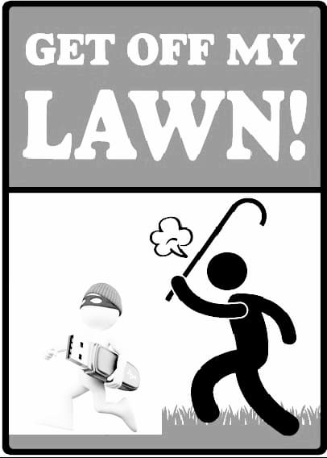

Welcome to Get Off My Lawn!
We hope to be a security extension for browsers to help prevent browser hijacking based on geolocation and OTP!

                      

`git server.html` 

For more details see [GitHub Flavored Markdown](https://guides.github.com/features/mastering-markdown/).

### Support or Contact

Having trouble with Pages? Check out our [documentation](https://help.github.com/categories/github-pages-basics/) or [contact support](https://github.com/contact) and we’ll help you sort it out.
